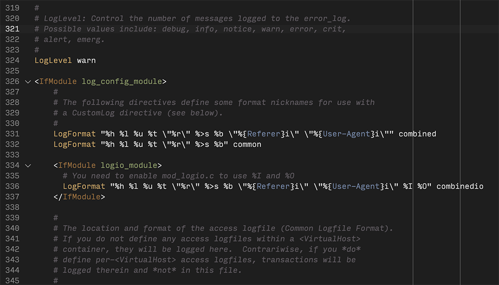
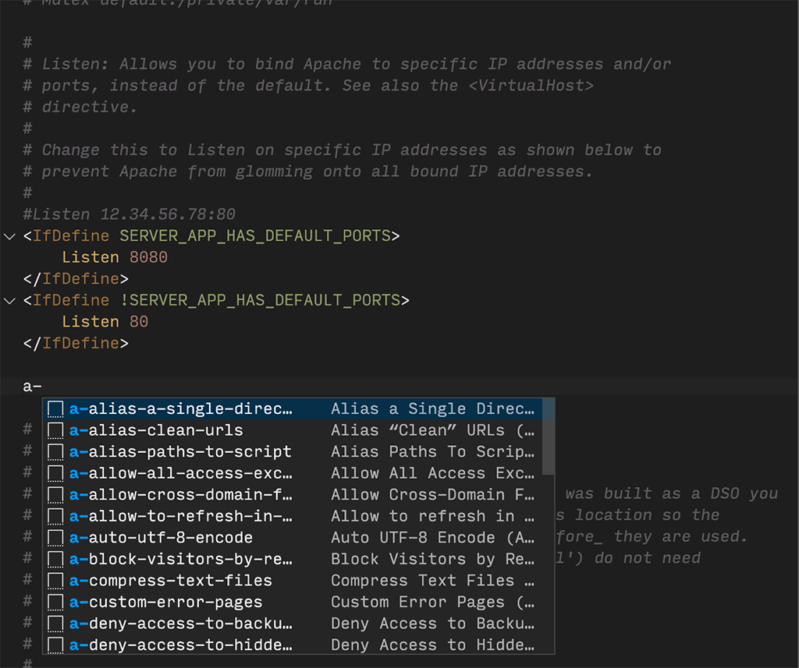

# Apache Extension Pack

While not many Apache conf extensions exist, the two that do provide the
essential syntax highlighting and snippets to help write configuration files.

## Extensions Included

* [Apache Conf](
  https://marketplace.visualstudio.com/items?itemName=mrmlnc.vscode-apache) -
  Syntax highlighter for Apache configuration files.
* [Apache Conf Snippets](
  https://marketplace.visualstudio.com/items?itemName=eiminsasete.apacheconf-snippets) -
  Apache Conf Snippets.

## Syntax Highlighting

## Snippets

**Enjoy!**

Apache and the Apache feather logo are trademarks of The Apache Software
Foundation.
